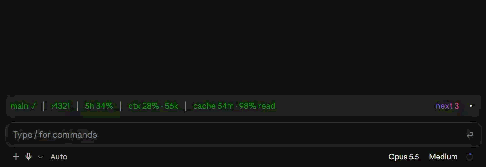
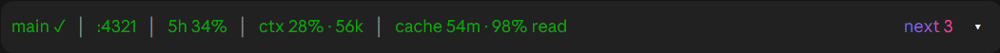
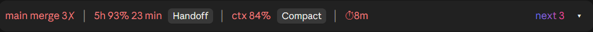
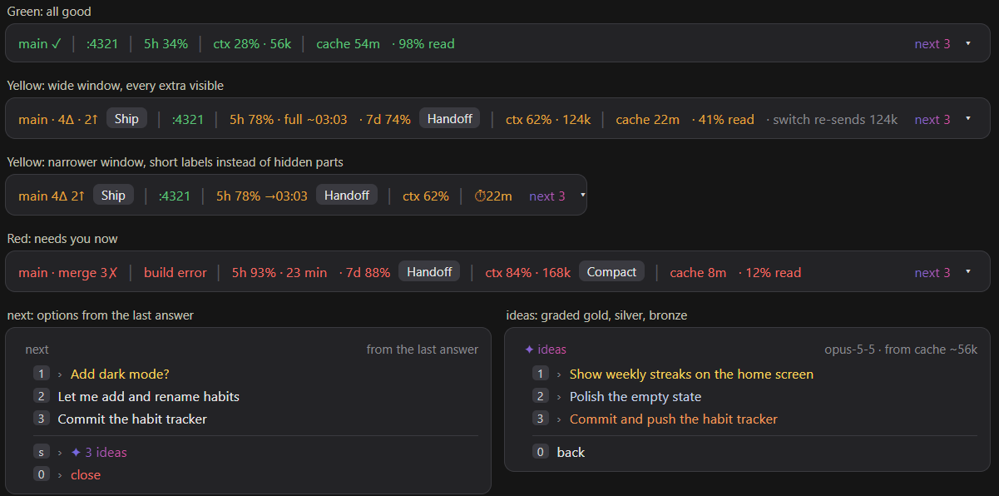
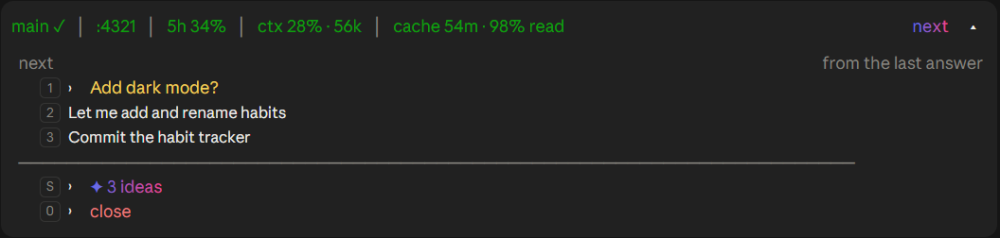
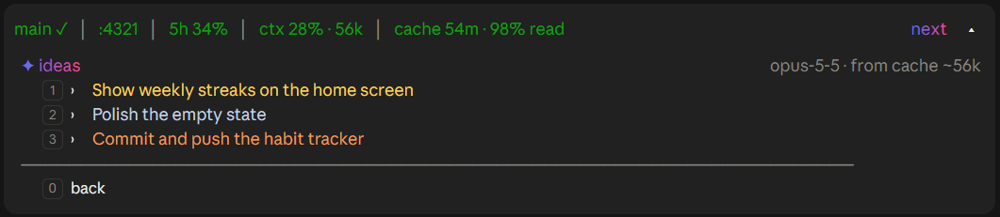

# OneLiner

**A calm instrument strip for Claude Code: 5-hour limit with forecast, prompt-cache countdown, context fill, one-click git ship, and next-step ideas - in one line above your prompt.**

[](https://github.com/deadraw/OneLiner/releases/latest)
[](LICENSE)
[](#install)







### Quick install

In Claude Code:

```
/plugin marketplace add deadraw/OneLiner
/plugin install oneliner@deadraw
```

Restart Claude Code. To get new versions automatically, turn on auto-update ([how](#from-the-marketplace-recommended)). [Full install notes ↓](#install)

---

## Why

Working with Claude Code all day, the same things keep costing time:

- **You hit the 5-hour limit in the middle of a task**, and the prompt you just sent is lost.
- **The prompt cache goes cold silently.** After an hour of inactivity, your next message re-sends the whole conversation at full price, and nothing tells you.
- **You lose track of git**: what's committed, what's pushed, whether a teammate (or another agent) pushed in the meantime.
- **Context fills up**, compaction happens, and you have to explain where you left off again.

**OneLiner** puts all of it in one line: green while everything is fine, yellow when it's getting tight, red when something needs you now.

## The strip



| Segment | Shows | 🟢 | 🟡 | 🔴 |
|---|---|---|---|---|
| **git** | branch, changed files (Δ), unpushed (↑), behind (↓) | clean and pushed | changes not shipped / behind (+ **Ship** button) | merge conflict, rebase stopped halfway, diverged |
| **dev** | your local dev server | running | - | build error (gray when off, + **Start**) |
| **5h limit** | 5-hour usage, forecast, reset time | ≤ 70% | 71–85% | ≥ 86% (+ **Handoff** button) |
| **ctx** | context window fill and tokens | ≤ 49% | 50–70% | ≥ 71% (+ **Compact** button) |
| **cache** | minutes until the prompt cache expires · % of the last turn read from cache | ≥ half the lifetime left | 25–50% left | < 25% left, cold, or reset (+ **Compact** from 30% context) |
| **next** | options from Claude's last answer + ideas on request | | | |

Extras that appear only when relevant:

- `· full ~16:40`: at your recent pace, the 5-hour window fills before it resets.
- `· 7d 74%`: the weekly window, shown from 70%.
- `· switch re-sends 306k`: what a `/model` switch would throw away (wide strip, warm cache, large context).
- `cache reset · effort`: you changed effort, thinking or fast mode, which empties the conversation cache.

On a narrow window the strip first drops the optional extras (switch hint, `% read`, `7d`), then switches to short labels (`main 4Δ 2↑`, `5h 78% →03:03`, `⏱22m`), and only then drops whole parts: **dev**, **git**, **ctx**. **Limit** and **cache** always stay.

## The next list

Click **`next ▾`** to open a short list above the prompt:

<p>
  
  
</p>

- **1–4**: the options Claude offered at the end of its last answer, shortened to one line. Free: no model call.
- **s ✦ 3 more ideas**: three new suggestions written the way you would ask, graded **gold / silver / bronze** by how much they move your current goal forward.
  - While the cache is warm, they're asked over the cached conversation (cheap).
  - When it's cold, Claude Haiku answers on a short digest instead.
  - Generated at most once per turn.

Picking an item fills your prompt box. Nothing is sent until you press Enter.

## Commands

| Command | Does |
|---|---|
| `/ship` | Commit (and optionally push). Runs your build first, writes the commit message, asks before pushing. Refuses during a conflict. |
| `/handoff` | Updates your `CURRENT.md` / `HANDOFF.md` from the conversation, keeping its structure. Asks before writing, keeps a backup. |
| `/limits` | A chart of the current 5-hour window: usage so far, pace, forecast, reset time, weekly window. |
| `/brief` | Where you left off in this project: open items from your handoff file, your last requests, last commits, uncommitted files. Also opens by itself after a gap of 6+ hours. |
| `/strip` | Turn strip parts on or off (`/strip cache`, `/strip all`). Saved for all projects. |
| `/strip demo green` | Sample values for screenshots: `green`, `yellow`, `red`, `next` (the list open), `ideas` (graded ideas), or `play` to loop through all of them for a screen recording. Buttons are off and nothing is spent; `/strip demo off` returns to your real values. |

## Popups (only when they matter)

- 5-hour limit at 90%, or the forecast says full within 30 minutes.
- A limit or credit error stopped your prompt: **switch model & resend**, or **resend at reset**.
- Someone else pushed to your branch: "*Alex pushed 2 commits to main - pull before you continue*".
- Your dev server rebuilt (or broke) after Claude edited files.
- A `/model` switch is about to drop a large warm cache.

## Install

Requires **Claude Code 2.1.286 or newer** (mods / function hooks).

### From the marketplace (recommended)

```
/plugin marketplace add deadraw/OneLiner
/plugin install oneliner@deadraw
```

Or from a terminal: `claude plugin marketplace add deadraw/OneLiner`, then `claude plugin install oneliner@deadraw`. Restart Claude Code and the strip appears after your first message.

**Updates.** After a marketplace install, OneLiner asks once, in a row under the strip: *Keep OneLiner up to date automatically?* Pick **Yes** and new versions install when Claude Code starts. Your answer is saved as `"autoUpdate"` on the marketplace entry in `~/.claude/settings.json` (Claude Code leaves auto-update off by default for marketplaces outside Anthropic's own).

To change it later:

- **Terminal:** `/plugin` → Marketplaces → **deadraw** → Enable / Disable auto-update.
- **Desktop app** (or by hand): in `~/.claude/settings.json`, set `"autoUpdate"` to `true` or `false`:

```json
"extraKnownMarketplaces": {
  "deadraw": {
    "source": { "source": "git", "url": "https://github.com/deadraw/OneLiner.git" },
    "autoUpdate": false
  }
}
```

With auto-update off, update by hand (the desktop app's Plugins page has an **Update** button too):

```
/plugin marketplace update deadraw
```

### Manual (git clone)

```bash
git clone https://github.com/deadraw/OneLiner ~/.claude/mods/OneLiner
```

Then load it in every session by adding this to `~/.claude/settings.json`:

```json
{
  "env": {
    "CLAUDE_CODE_PLUGIN_DIRS": "~/.claude/mods/OneLiner"
  }
}
```

If you already load other plugin folders, separate the paths with `;` on Windows and `:` on macOS/Linux. Restart Claude Code (desktop app or terminal). Update later with `git pull` in that folder. Use one install method, not both.

To try it for one session only:

```bash
claude --plugin-dir ~/.claude/mods/OneLiner
```

## How accurate is it?

The numbers come from Claude Code itself, not estimates:

| Value | Source |
|---|---|
| 5h / 7d limit % | the rate-limit reading on each API response |
| ctx % and tokens | the same figures as Claude Code's own status line |
| % read | cache-read ÷ total input tokens of the last turn, as reported by the API |
| cache lifetime | 1 hour on subscription sessions, 5 minutes in extra usage; switched automatically, and taken from Claude Code when it reports it (model switch, resume) |

The cache clock starts at the **start** of the last request, which is how the API measures it, and resets on a model switch, compaction, or an effort / thinking / fast-mode change.

Measured across ~6,900 requests from real sessions, by the gap since the previous request:

| Gap | Read from cache |
|---|---|
| under 5 min | 97.7% |
| 5–55 min | 92.2% |
| 65 min or more | **0%** |

That cliff after one hour is what the cache segment counts down to.

The **limit forecast** is an estimate: a straight line through the last 30 minutes of readings. Treat it as an early warning, not a promise.

## What costs tokens

Almost nothing. Everything on the strip is read from data Claude Code already has.

| Feature | Cost |
|---|---|
| The strip, popups, `/limits`, `/brief`, `/strip`, options from the last answer | free |
| `✦ 3 more ideas` | one small question; cheap from a warm cache, a few thousand Haiku tokens otherwise |
| `/handoff` | one question over the cached conversation, plus writing the file |
| `/ship` commit message | one short Claude Haiku call |
| Handoff note before compaction (`.claude/handoff.md`) | one question over the cached conversation, once per compaction |

## Privacy

No telemetry, no external services. The mod only:

- runs `git` in your project (including a background `git fetch` every 5 minutes, which downloads but never changes your files),
- checks your local dev server on `localhost`,
- reads and writes handoff files in your project when you ask,
- after a marketplace install, writes your auto-update answer to `~/.claude/settings.json`, once, after asking.

## Customize

Everything tunable is a named setting at the top of [`hooks/register.tsx`](hooks/register.tsx):

| Setting | Default |
|---|---|
| `LIMIT_YELLOW_PCT`, `LIMIT_RED_PCT`, `LIMIT_WARN_PCT` | 71, 86, 90 |
| `CONTEXT_YELLOW_PCT`, `CONTEXT_RED_PCT` | 50, 71 |
| `CACHE_GREEN_SHARE`, `CACHE_RED_SHARE` | 0.5, 0.25 |
| `CACHE_COMPACT_MIN_PCT` | 30: below this context fill, a cold cache gets no Compact button (re-sending is cheaper) |
| `GRADE_COLORS` | gold `#F7D35C`, silver `#C4D3E6`, bronze `#EE9D5B` |
| `GRADE_STYLE` | `'text'` (colored text) or `'dot'` (colored ●) |
| `IDEAS_FROM`, `IDEAS_TO` | the `next` gradient, `#6a6ae4` → `#e34a9e` |
| `SHIP_BUILD` | `true`: build before committing |
| `BRIEF_GAP_HOURS` | 6 |

Handoff files are looked for at `.claude/handoff.md`, `Current.md`, `CURRENT.md`, `HANDOFF.md`, `handsoff/CURRENT.md`, `handoff/CURRENT.md` and `docs/handoff.md`; the most recently edited one wins.

## Limitations

- Mods are an **early-access** Claude Code API and may change between releases.
- Claude Code buttons can't be colored, so colored rows are clicked on the small `›` next to them (or with their number key).
- Switching fast mode or thinking with a **keyboard shortcut** may not be reported to mods; the low `% read` on the next turn still shows the cache was rebuilt.
- The 5-minute cache in extra usage is detected from the limit reading (≥ 100%).
- Developed and used on Windows. macOS and Linux should work; reports welcome.

## License

[MIT](LICENSE) © deadraw
